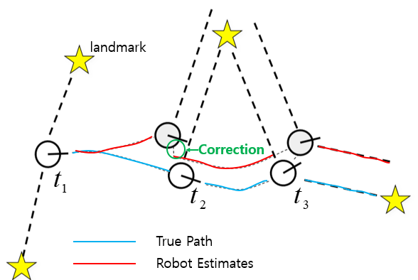

# 2020.10.07-SLAM

# Introduction to SLAM (Cyrill Stachniss, 2020)

[Introduction to SLAM (Cyrill Stachniss, 2020)](https://www.youtube.com/watch?v=0I30M6yTklo&t=3s)

## Topic of the Course

Simultaneous Localization and Mapping

- Graph-based SLAM using pose graphs
- Graph-based SLAM with landmarks
- Robust optimization in SLAM
- Relative pose estimation using vision

## What is SLAM?

SLAM은 로봇의 위치와 map을 동시에 계산하는 것이다. 

**1. Localization:** 로봇의 위치를 추정함, 제어 명령보다 1 index 많다. 

$x0:T=x0,x1,x2,...,xT$

**2. Mapping:** map을 만들어준다, 주변 환경이 어떻게 생겼는가? Noisy한 sensor데이터를 통해 현재 위치에서 랜드마크의 위치를 그리는 것.

$m$

Noisy한 sensor데이터를 통해 현재 위치에서 랜드마크의 위치를 그리는 것.

**3. *SLAM*:**  로봇의 경로를 실시간으로 추정하고 로봇 제어를 통해 지도를 작성

- 로봇으로 들어가는 제어 명령

    $u1:T=u1,u2,...,uT$

- 센서로부터 관측되는 값

    $z1;T=z1,z2,...,zT$

    

## The SLAM Problem

## Probabilistic Approaches

로봇이 실제 환경에서 움직일 때 오차가 발생 할 수 있다. 예를 들자면 1m를 이동하라고 해도 주위 환경의 장애요소로 인해 오차가 점점 쌓이게 된다. 그래서 SLAM에서는 **확률적 접근법**을 사용한다. 

수학적으로 설명하자면 센서로부터 관측되는 값과 제어명령이 주어졌을 때, 로봇의 위치와 맵의 확률을 알아내는 것이다. 이를 해결하기 위한 3가지 접근법이 존재한다. 

1. gaussian 분포를 가정하는 문제에서는 **Kalman filter 접근법**

2.다양한 분포에관해서는 **Particle filter 접근법**

3.Kalman filter보다는 보다 general하게 사용할 수 있는 **graph-based 접근법**

## Graphical models

위의 식처럼 discrete time 간격으로 0부터 T까지 맵과 경로를 추정하는 것을 Full-SLAM이라고 한다.

Full SLAM의 Graphical Model

그림에서 화살표는 영향을 미치는 방향을 의미한다. 

- 이전 위치  ($x_{t−1}$)로 부터 얼마만큼 이동했는지 ($u_t$)에 따라 현재위치($X_t$)가 결정된다.
- 관측되는 정보($Z_t$)는 현재위치($X_t$)와 환경지도($m$)의 영향을 받는다.

## Online SLAM

Full-SLAM은 0부터 T까지 모든 정보를 가지고 로봇의 모든 위치와 맵을 추정한다. 이것을 데이터 후처리 방식이라고 한다. 

하지만 우리는 현재위치($X_t$)를 실시간으로 추정하는 것이 가장 중요하기 때문에 현재 시점을 중심으로 두는 **Online SLAM**을 사용 해야한다. 

즉, 이전까지의 모든 제어 명령과 센서 데이터를 가지고 현재 시점에서의 로봇의 위치와 환경정보를 추정하는 것을 말한다. 

## Why is SLAM a Hard Problem?

그런데 이러한 SLAM이 어려운 이유가 있다. 바로 불확실성(uncertainty)가 계속 누적되기 때문.

빨간색 원이 불확실성을 표시한 그림, 노란색 별이 Landmark이고 하얀색 원이 로봇이다. 불확실성이 커지는 순서를 대략적으로 설명하자면.

1. 처음 위치에서는 Landmark에 대한 **관측 불확실성**($a_1$)만 존재함.
2. 두 번째 위치로 이동을 하니까 **위치 불확실성**($b_1$)이 추가된다.  
3. 불확실성을 가진 상태에서 Landmark를 추정하다보니 **관측 불확실성**($a_2$)이 또 추가됨
4. 결국 $a_1 + b_1 + a_2 + b_2+...$ 과 같이 반복되며 값이 커진다. 

## Motion and Observation Model

그렇다면 이러한 불확실성을 어떻게 해결 해야될까? 많은 방식들이 존재하지만, 우리는 앞서 본   

Kalman filter, particle filter, graph-based의 3가지 방식으로 나눌 수 있다. 그리고 이 방식들은 모두 motion model과 observation model의 개념을 사용한다. 

**Motion model:** 이전 위치와 제어 명령이 있을 때 새로운 현재 위치는 어떻게 될까? 

**Observation model:** 현재 위치를 알고 있을 때 랜드마크(관측값) 위치는 어떻게 될까?

