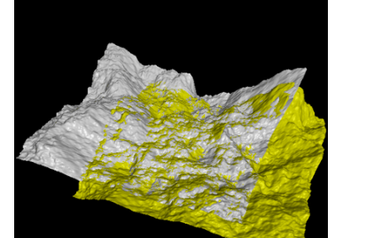

# Point Cloud Alignment using ICP

## Alignment of 3D Data Points

- 해당 데이터 포인터를 가장 잘 정렬해주는 변환 매개변수를 찾아야 된다.
- Optimization을 위한 2가지 방법
    - Least squares and robust least squares
    - Iterative closest point (ICP)

    

    - 실제로 2개의 3D 모델이 있을 때 좌표 변환을 통해서 물체의 공통 위치를 찾아서 맞춘다.

## Iterative Closest Point (ICP)

그렇다면 어떻게 서로 다른 물체를 반복적으로 움직여서 공통적인 위치를 맞출 수 있을까? 

거기에 대한 해답은 ICP 알고리즘에 있다. ICP알고리즘은 컴퓨터 그래픽스에서 주로 사용되어 왔다. 어떠한 모델에 대한 측정 데이터가 있을 때, 이 측정 데이터를 모델에 매칭하기 위해 스케일 변환, 회전, 이동을 계산하는 방법이다.  

[https://www.youtube.com/watch?v=jbtxvG-4m9s](https://www.youtube.com/watch?v=jbtxvG-4m9s)

여기서는 지도를 계속 업데이트 하지는 않고, ICP_test 프로그램이 시작될 때 처음 한 번 읽어온 레이저 스캐너 데이터를 모델로 보고 이후 들어오는 데이터를 모델과 매칭시킨다.

- **매칭 과정에 대한 식**

    

    Q와 P라는 서로 다른 좌표(Point Cloud)의 값이 주어졌을 때 이 둘을 매칭시키기 위한 식이다. R은 회전을 위한 파라미터이고, t는 이동을 위한 파라미터 값이다. 위의 식에서는 Q는 그대로 두고 P의 좌표를 변형시키면서 서로 다른 두 좌표의 오차를 점점 줄여간다. 

    

    Red 라인과 Blue 라인의 차이를 최소화 하는 과정

## SVD-Based Alignment Summary

- **Center of Mass**

    

    

    질량의 중심을 구해서 모든 점에서 해당 중심을 빼준다. 두개의 좌표들을 원점으로 이동시켜서 비교하려는 과정이다.

- **Orthogonal Procrustes Problem**

    

    

    위의 식이 Minmizing 과정이고, 아래 식도 이와 비슷한 과정을 진행한다. E'(R)의 식을 Orthogonal Procrustes problem이라고 한다. 

    

    이를 직교 문제라고 부르는 이유는 이미 평균을 뺀 값은 원점을 공유하고 있기 때문에 Point Cloud의 벡터의 방향만 맞춰주면 되기 때문에 붙여진 것 같다. 

    그리고 이는 SVD 접근법을 사용해서 해결한다. 

- **Singular Value Decomposition**

    

    위의 식은 특이값 분해(SVD)를 이용해서 포인트 클라우드 $p_j$ 를 업데이트 해주는 식이다. 

    

    

    위의 식과 같이 U, V*는 rotation을 위한 직교 행렬이다. 이 값을 업데이트 해준다면 원점에 $p_j$를 $q_j$ 에 맞춰줄 수 있다.  

## ICP with Unknown Data Association

정확한 데이터들의 관계를 파악할 수 없는 경우 한 단계 만에 회전과 변환을 결정하는 것은 불가능하다.  

그래서 나온 아이디어가 Iterative Closest Point (ICP)알고리즘 이다. 좌표가 충분히 정렬될 만큼 횟수를 반복해서  찾는 것이다. 

- **ICP 알고리즘의 4가지 단계**

    
